<div align="center">



私の開発環境のベースとなる設定ファイル


</div>

## 内容物

| ファイル | 説明 |
| --- | --- |
| `tmux.conf` | tmuxの設定ファイル |
| `wezterm.lua` | WezTermの設定ファイル |
| `gitconfig` | gitの設定ファイル |
| `zshrc` | zshの設定ファイル |
| `bashrc` | bashしかない小さい環境向けの最小設定ファイル |
| `nvim/init.lua` | neovimの設定ファイル |
| `vimrc` | vimの設定ファイル |
| `alias` | エイリアスをまとめて設定したファイル。bashでも利用可能。追加ツールがある場合だけ拡張されます |
| `starship.conf/*.toml` | starshipの設定ファイル |
| `scripts/imgcat` | iTerm2のInline Images Protocol用スクリプト。iTerm2の公開スクリプトを元に、WezTermで使いやすいように調整しています |
| `install.sh` | 各設定ファイルをホームディレクトリへsymlinkするスクリプト |

## 使い方

### 必須条件
- mac or linux
- gitが使えること

### 1. 環境準備
miseを用いてライブラリやコーディングツールをインストールします

```sh
curl https://mise.run | sh
```
完了したら以下を実行します。
- 最小構成
```sh
mise use -g bat starship
```
- おすすめのライブラリ
```sh
mise use -g uv bat aws-cli bun claude-code delta starship opencode eza tmux dust
```

### 2. 設定の反映

リポジトリをcloneして、インストールスクリプトを実行します。

```sh
git clone https://github.com/BIG-A-K/dotfiles.git ~/dotfiles
cd ~/dotfiles
./install.sh
```

端末から引数なしで実行すると、どのモジュールを反映するかを選ぶメニューが出ます。番号でトグルし、Enterで決定します。

```
== インストールするモジュールを選択 ==
   1) [x] zsh       ~/.zshrc (zsh-autosuggestions の submodule も更新)
   2) [x] bash      ~/.bashrc
   ...
   8) [x] nvim      ~/.config/nvim

番号でトグル (例: 1 3 5) / a=全選択 / n=全解除 / q=中止 / Enter=決定 >
```

#### モジュール単位の更新

tmuxやNeovimの設定だけ入れ直したい場合は、モジュール名を直接渡します。メニューは出ません。

```sh
./install.sh nvim tmux
```

モジュールの一覧は `-l, --list` で確認できます。メニューを出さずに全部入れる場合は `-a, --all` を指定します（パイプ経由などTTYでない環境では自動的に全モジュールが対象になります）。

```sh
./install.sh --list
./install.sh --all
```

#### submoduleと既存ファイルの扱い

`zsh` モジュールを選ぶと、symlinkを張る前に `git submodule sync --recursive` と `git submodule update --init --recursive` を実行するので、submoduleの取得・更新を手動で行う必要はありません。スキップしたい場合は `--skip-submodules` を指定します。

```sh
./install.sh --skip-submodules
```

既存のsymlinkは常に張り替えます。既存の実ファイル・ディレクトリがある場合は、対話実行なら `~/.dotfiles-backup/YYYYmmdd-HHMMSS/` へ退避してよいかその場で確認します。非対話実行ではスキップされるので、`-f, --force` を指定すると確認なしで退避します。

Starshipの設定は `earth` がデフォルトです。既にsymlinkが張られている場合は、そのプロファイルを引き継ぐので、一部のモジュールだけ入れ直してもテーマは変わりません。別のプロファイルを使う場合は `--starship` を指定します。

利用可能なプロファイルは `mercury`, `venus`, `earth`, `mars`, `jupiter`, `saturn`, `uranus`, `neptune` です。

```sh
./install.sh --starship mars
```

変更内容だけ確認したい場合は `--dry-run` を使います。

```sh
./install.sh --dry-run
```

既存ファイルの退避を確認なしで行う場合は `-f, --force` を使います。

```sh
./install.sh --force
```


#### starshipのカラーテーマ
starshipのテーマに合わせてtmux.confのカラーテーマも変わります。どのように変わるかは以下のスクリプトで一覧を見ることが出来ます。
```bash
./scripts/starship-list.sh
```


### 作成されるリンク

- `~/.zshrc` -> `zshrc`
- `~/.bashrc` -> `bashrc`
- `~/.alias` -> `alias`
- `~/.gitconfig` -> `gitconfig`
- `~/.vimrc` -> `vimrc`
- `~/.tmux.conf` -> `tmux.conf`
- `~/.tmux.theme.conf` -> `tmux.conf.d/<profile>.conf`
- `~/.config/wezterm/wezterm.lua` -> `wezterm.lua`
- `~/.config/nvim` -> `nvim`
- `~/.config/starship.toml` -> `starship.conf/<profile>.toml`
- `~/.local/bin/imgcat` -> `scripts/imgcat`
